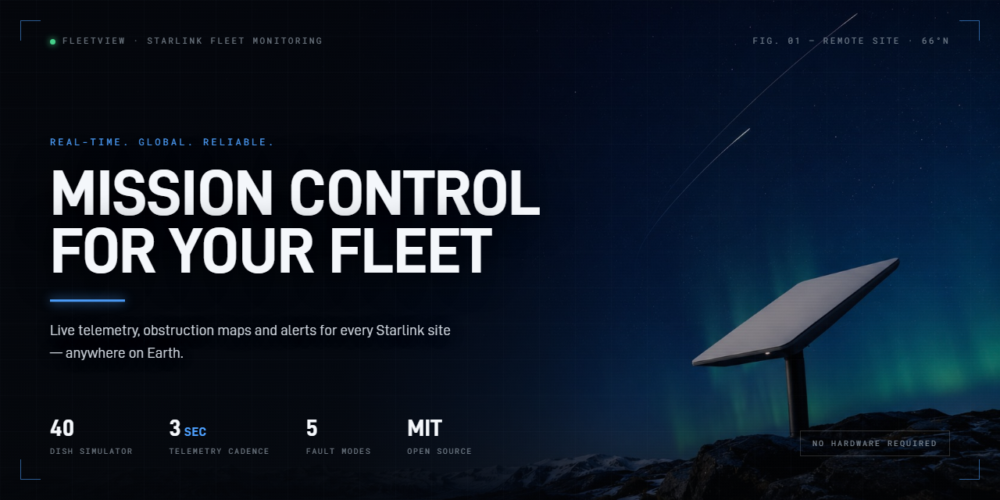
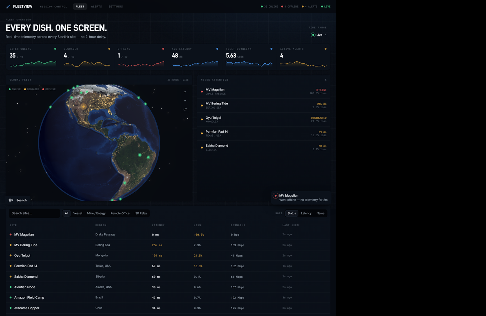
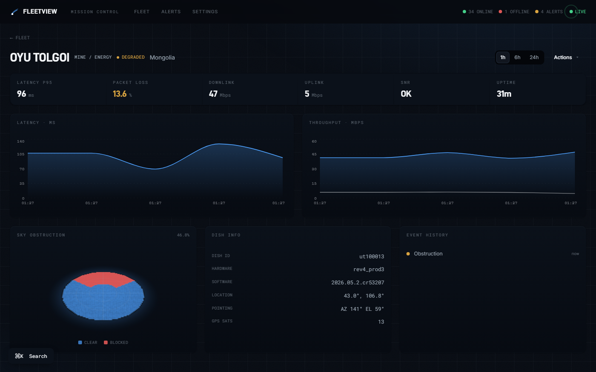
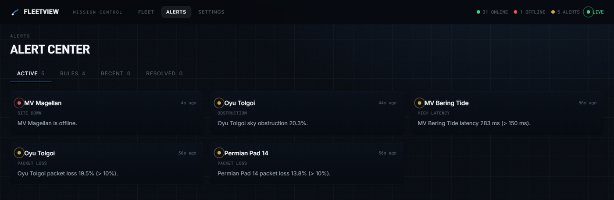
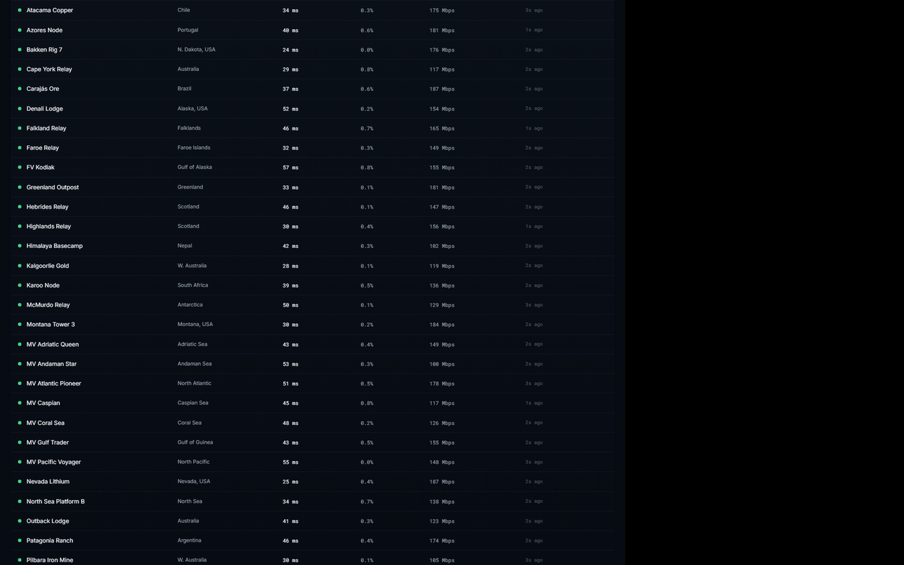
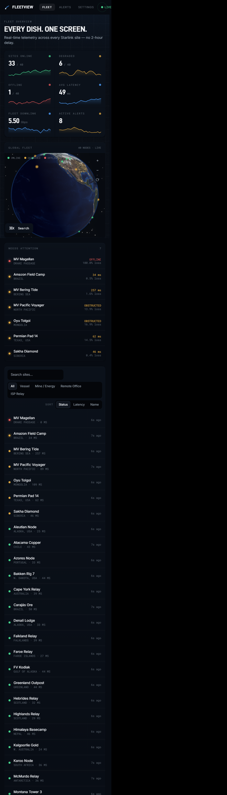

<div align="center">



# FleetView

**Open-source monitoring for a fleet of Starlink dishes.**
Live telemetry, obstruction maps and alerting for every site — maritime, mining, remote camps, ISP relays.

[](LICENSE)


### [▶ Try the live demo](https://starfleetapp.github.io/fleetview/app)

A 40-dish fleet in your browser — no install, no signup. The demo replays a
snapshot of real telemetry client-side, so nothing is actually being polled;
run it locally (below) for the genuine simulator, agent and API.



</div>

---

## No dish? No problem.

The hard part of building anything for Starlink is that you need a dish — ideally
forty of them, in bad weather, on the other side of the planet.

So FleetView ships **its own fleet**. One command starts 40 simulated dishes that
speak the *real* [Starlink local gRPC protocol](docs/starlink-local-api.md), each
with believable telemetry, plus fault injection you can trigger from a terminal:

```bash
npm run setup   # once
npm run dev     # 40 dishes + agent + cloud + dashboard
```

Open **http://localhost:5273**. That's the screenshot above, running on your machine
in about ten seconds — no hardware, no accounts, no API keys, no Docker.

Point it at a real dish when you have one. **It's the same agent either way.**

## Break things on purpose

Every simulated dish has a control plane. Knock a vessel offline and watch the map
turn red, the alert fire, and the site drop into "needs attention":

```bash
curl -X POST http://127.0.0.1:8799/scenario \
  -H 'content-type: application/json' \
  -d '{"id":"mv-pacific-voyager","mode":"obstructed"}'
```

Modes: `normal` · `offline` · `obstructed` · `high_latency` · `degraded` · `thermal`
Reset everything with `curl -X POST http://127.0.0.1:8799/scenario/reset`.

This is the bit that's genuinely hard to get any other way. Reproducing a thermal
shutdown, a mid-poll reboot, or a tree growing into the sky view is otherwise a
matter of waiting months and getting lucky.

## What you get

|  |  |
| --- | --- |
|  |  |
| **Per-site detail** — latency/throughput history, dish info, event log, and a rendered **sky obstruction map** showing exactly what's blocking the view. | **Alerting** — site down (debounced so blips don't page you), obstruction, packet loss, high latency. Slack and email, or console-only with nothing configured. |

| Fleet table | Mobile |
| --- | --- |
|  |  |

- **Live, not lagged** — telemetry lands in seconds, over a WebSocket.
- **Any dish** — reads the local API directly, so no reseller/account-manager gating.
- **Store-and-forward** — the agent buffers to local SQLite; a site that loses its
  uplink backfills when it returns instead of leaving a hole in your charts.
- **Mobile-first dashboard** — it's a monitoring tool; you'll read it on a phone.

## How it works

```
 SITE (per dish)                         CLOUD (server/)               BROWSER
 ┌─────────────────────┐                 ┌────────────────────┐        ┌──────────────┐
 │ Starlink dish        │   HTTPS push   │ /ingest (token auth)│  ws    │ Dashboard     │
 │ 192.168.100.1:9200   │  batched JSON  │   ▼                 │───────▶│ live fleet    │
 │ (local gRPC)         │ ──────────────▶│ SQLite / Postgres   │        │ map + charts  │
 │   ▲ poll             │                │ alert engine        │        └──────────────┘
 │   │                  │                │   └ Slack / email ──┼───────▶ notifications
 │ EDGE AGENT           │                └────────────────────┘
 │ status 10s / hist 30s│
 │ SQLite store-&-fwd   │
 └─────────────────────┘
        ▲  (demo: the agent polls the simulator instead of a real dish)
 ┌──────┴──────────────┐
 │ DISH SIMULATOR ×40   │  realistic telemetry + fault injection
 └─────────────────────┘
```

| Directory | What it is |
| --- | --- |
| `proto/` | The gRPC contract (`SpaceX.API.Device`) — loaded by both simulator and agent |
| `simulator/` | 40 fake dishes + the scenario control plane |
| `agent/` | Edge agent: poll → normalize → buffer → ship. Runs anywhere, incl. a Pi |
| `server/` | Ingest, REST API, WebSocket realtime, alert engine |
| `web/` | React + Vite dashboard and marketing site |
| `supabase/` | Production Postgres schema + ingest Edge Function |

Roughly 4,300 lines total. It's meant to be read.

## Point it at a real dish

The agent is the same code in production — one container per site:

```bash
docker build -f agent/Dockerfile -t fleetview-agent .
docker run -d --restart=unless-stopped \
  -e DISH_ADDR=192.168.100.1:9200 \
  -e SITE_TOKEN=flv_xxxxxxxx \
  -e CLOUD_INGEST_URL=https://your-cloud/ingest \
  fleetview-agent
```

Generate a `SITE_TOKEN` in the dashboard under **Settings → Add a site**.

Two networking notes that cost people hours: in **bypass mode** you need a static
route to `192.168.100.0/24`, and **multiple dishes on one flat LAN all claim
`192.168.100.1`** — give each its own subnet. Both are covered in the API doc below.

## 📡 How the Starlink local API works

Every dish runs an unauthenticated gRPC server on your LAN that will tell you
everything about itself. It's undocumented, community-reverse-engineered, and full
of traps — the history endpoint is a forever-incrementing ring buffer that will
silently double-count if you poll it naively, and fields disappear between firmware
releases.

**[→ Read the write-up](docs/starlink-local-api.md)** — the protocol shape, the three
calls worth making, the ring-buffer de-dup with working code, what breaks across
firmware, and how to explore a dish with `grpcurl`.

It's the documentation we wanted when we started, and it's useful whether or not you
ever run FleetView.

## Deploying

The local stack runs on Node's built-in SQLite. For production, the schema mirrors
the Postgres migration in [`supabase/`](supabase/README.md) — `supabase db push`,
deploy the ingest function, point agents at it. Row-level security gives per-org
isolation. A [`render.yaml`](render.yaml) is included for one-click Render deploys.

## Requirements

Node **≥ 22** (uses built-in `node:sqlite`). That's it — gRPC is pure JavaScript
(`@grpc/grpc-js`), so there's nothing to compile and no Docker needed to develop.

## Contributing

Issues and PRs welcome. Genuinely useful directions:

- **More dish behaviours** in the simulator — snow, rain fade, motor faults, roaming
- **Real-dish firmware reports** — which fields exist on your hardware/software version
- **Failover** — router API integrations (RouterOS, Teltonika, Peplink, OPNsense)
- **Exporters** — Prometheus, SNMP, InfluxDB
- **Deploy targets** — a Raspberry Pi image for the agent

## License

[MIT](LICENSE). Do what you like with it.

The bundled Earth textures are NASA public domain; fonts are OFL / Apache-2.0.

> **Not affiliated with SpaceX.** "Starlink" and "SpaceX" are trademarks of Space
> Exploration Technologies Corp. The local device API is unofficial and
> reverse-engineered by the community — fields change without notice and nothing
> here is supported by SpaceX. The pricing shown on the bundled marketing pages is
> part of the demo UI, not a real commercial offering.
